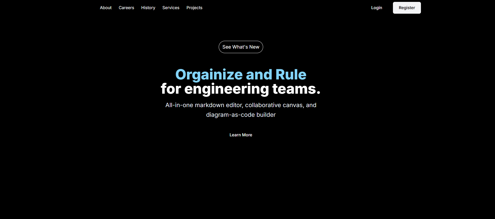
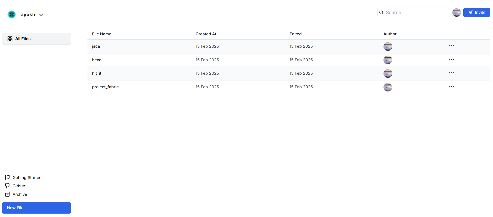
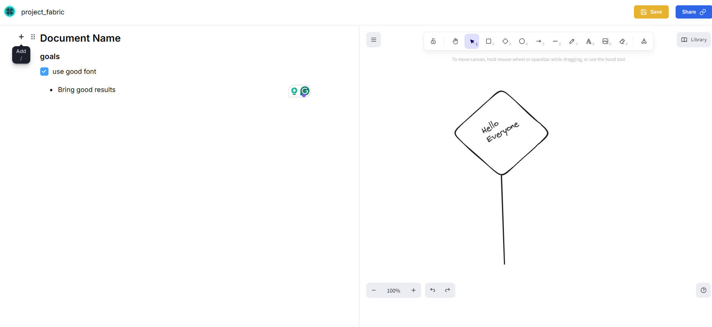
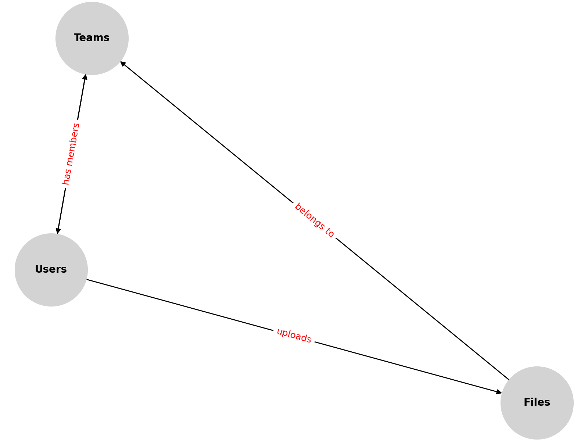

### Fabrics - A consistent planner for your ideas to take place







<div>
  
  
  
  
  
  
</div>

<h3 align="center">Fabrics – AI-Powered Design Generator</h3>

## 📋 Table of Contents

1. [Introduction](#introduction)
2. [Tech Stack](#tech-stack)
3. [Features](#features)
4. [Quick Start](#quick-start)
5. [Database Schema](#database-schema)

## 🤖 Introduction

**Fabrics** is Team planner and Idea management platform where people can turn their ideas into simple diarams that can help them soothen the workflow and build something unique and crazy. Like clothes are woven with fabrics where placement and pattern matters the most in deciding the final result, Samwise fabric could help in weaving your ideas into amazing products.

## ⚙️ Tech Stack

- **Frontend:** Next.js, React, TailwindCSS
- **Backend:** Kinde Authentication, Convex Database
- **Database:** Convex
- **Authentication:** Kinde for secure user authentication
- **Deployment:** Vercel

## 🔋 Features

- **Customizable Designs:** Users can visually draw your ideas before finalizing.
- **Cloud-Based Storage:** Seamless integration with Convex for secure and scalable storage.
- **User Authentication:** Secure login and registration using Kinde.
- **Real-Time Previews:** Instantly preview generated designs before saving.
- **Responsive UI:** Optimized for both desktop and mobile devices.

## 🤸 Quick Start

Follow these steps to set up the project locally on your machine.

### Prerequisites

Ensure you have the following installed on your machine:

- [Git](https://git-scm.com/)
- [Node.js](https://nodejs.org/en/) (v14+ recommended)
- [npm](https://www.npmjs.com/) or [Yarn](https://yarnpkg.com/)

### Cloning the Repository

Clone the repository and navigate to the project directory:

```bash
git clone https://github.com/Ayush110103/fabrics.git
cd fabrics
```

### Installation

Install the project dependencies:

```bash
npm install
# or, if you use Yarn:
# yarn install
```

### Running the Project

Start the development server:

```bash
npm run dev
# or, with Yarn:
# yarn dev
```

## 📊 Database Schema



---

### 🚀 Contributing

Contributions are welcome! Feel free to fork this repository and submit a pull request with your improvements.

### 📬 Contact

For inquiries, reach out via [LinkedIn](https://linkedin.com/in/ayushjain1101) or [GitHub](https://github.com/Ayush110103).
